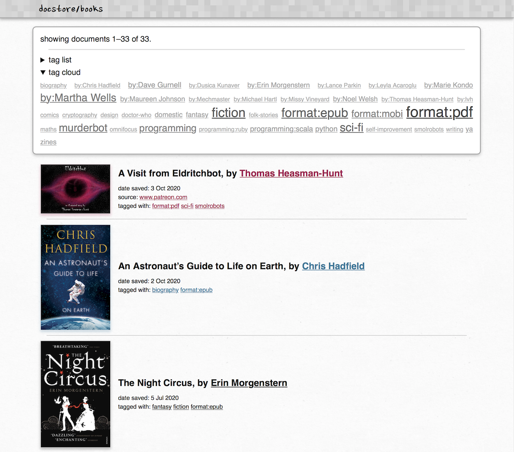

# docstore

docstore is a tool I wrote to help me manage my scanned documents and reference files.
It uses [keyword tagging](https://en.wikipedia.org/wiki/Tag_(metadata)) to categorise files, and creates thumbnails to help identify files.

It has two parts:

*   A CLI tool that lets me store new documents
*   A web app that lets me browse the documents it's already stored

Here's a screenshot of the web app:



I don't expect that anybody else will want to use docstore directly, but the ideas might be useful.
The rest of this README describes some of the motivation and design.


## Why I wrote it

*   **I prefer keyword tagging to files-and-folders as a way to organise files.**
    I'm a particular fan of how [Pinboard](https://pinboard.in/) does tagging, but I haven't found an app that stores files with Pinboard-like.

*   **I want my documents stored locally.**
    My scanned paperwork in particular contains a lot of private information -- bank statements, medical letters, rental contracts, and more.
    I don't want to upload them to a cloud service and risk them being leaked.

*   **I'm very picky about how this sort of thing.**
    I've tried a bunch of other apps and services for doing this sort of thing, but none of them were quite right.
    I found it easier to write my own tool than try to use something written by somebody else.

    It helps that my needs are quite simple -- the whole app is about a thousand lines of code, which is pretty manageable.


## Design principles

*   **Use JSON as a database.**
    All the metadata about my documents is kept in a single JSON file.
    JSON is a simple, popular format with several advantages for me:

    -   Lots of tools can read it.
        Pretty much every programming language has a JSON parser, so I'm guaranteed I'll be able to parse the metadata file for years to come.
    -   I can edit JSON in a text editor.
        This saves me building editing features into docstore -- if I've made a typo or want to change something, I can edit the metadata JSON directly.
    -   It maps directly to Python data structures (Python is what I use to write docstore).
        The serialisation and deserialisation isn't very complicated.

    If you were building an app that had to store a lot of documents or support multiple users, JSON would be a poor choice -- you'd want to use a proper database instead.
    My biggest docstore instance only has a few thousand files, and the cost of JSON parsing is negligible.

*   **A document can have multiple files.**

    This wasn't part of my original design, but I added it when I rewrote docstore in autumn 2020.
    This means that I can group files together -- for example, if I have two scans of the same original document.

    Here's an example of how a document is described in the JSON:

    ```json
    {
      "date_saved": "2020-10-03T16:30:08.471833",
      "files": [
        {
          "checksum": "sha256:fe79444e61b9c009a22497a9878020da98f557476b7f993432bc94fa700e888a",
          "date_saved": "2020-10-03T16:30:08.471833",
          "filename": "Eldritchbot.pdf",
          "id": "331e2b59-fe82-48a4-8d59-f71b0f2ad7b3",
          "path": "files/e/eldritchbot.pdf",
          "size": 2215466,
          "source_url": "https://www.patreon.com/posts/visit-from-40137342",
          "thumbnail": {
            "path": "thumbnails/E/Eldritchbot.pdf.png"
          }
        }
      ],
      "id": "9dd532c7-edf9-428a-9637-df9bb6030378",
      "tags": [
        "smolrobots",
        "sci-fi",
        "format:pdf",
        "by:Thomas Heasman-Hunt"
      ],
      "title": "A Visit from Eldritchbot"
    }
    ```

*   **Stay close to the original filename.**

    As much as possible, I want docstore to use the original filename.
    This makes the underlying storage human-readable, and it means that if I lost the metadata, the files would still be somewhat useful.

    Here's what the underlying storage looks like:

    ```
    docstore/
    └── files/
        ├── a/
        │   ├── admin-renewal-cover-letter.html
        │   ├── advice-for-patients-and-visitors.pdf
        │   └── application-paperwork.pdf
        ├── b/
        ├── c/
        └── ...
    ```

    docstore records the original filename in the metadata, and then does some normalisation before copying a file to its storage.
    The normalisation does a couple of things:

    *   Remove any special characters and spaces.
        e.g. `alex.chan › payslip › january 2015–2016.pdf` becomes `alex-chan-payslip-january-2015-2016.pdf`

    *   Lowercase the filename.
        e.g. `P60Certificate.pdf` becomes `p60certificate.pdf`

    *   De-duplicate documents with the same name by adding some random hex to the end of the name.
        e.g. if I store two documents called `statement.pdf`, one will be stored as `statement.pdf` and the other as `statement_f97b.pdf`.

    This normalisation means I don't have to worry about whether my filesystem can cope with weird characters, or if I'm storing two different files with the same name.
    
    The thumbnails for each file use a similar filename, so it's easy to find the thumbnail that corresponds to a file (and vice versa).
    For example, if a document is stored as `p60-certificate.pdf`, the thumbnail is stored as `p60-certificate.pdf.png`.

    These normalised filenames aren't exposed through the web app – if I'm downloading a file, docstore sets a [`Content-Disposition` header](https://developer.mozilla.org/en-US/docs/Web/HTTP/Headers/Content-Disposition) that tells my browser to download it with the original filename.


## Technology

*   docstore is written in **Python**.
    The web app uses [**Flask**](https://pypi.org/project/Flask/), and the CLI uses [**Click**](https://pypi.org/project/click/).
*   I use [**attrs**](https://pypi.org/project/attrs/) for the internal models, and [**cattrs**](https://pypi.org/project/cattrs/) to serialise my internal models to JSON.
*   I use [macOS **Quick Look**](https://en.wikipedia.org/wiki/Quick_Look) and [**ffmpeg**](https://ffmpeg.org) to create thumbnails, and a [*k*-means clustering algorithm](https://alexwlchan.net/2019/08/finding-tint-colours-with-k-means/) to get the tint colour to go with the thumbnails.
*   The filename normalisation is based on the blog post ["ASCIIfying" by Dr. Drang](http://www.leancrew.com/all-this/2014/10/asciifying/)
*   The code for displaying tags in a list is based on [templates from Dreamwidth](https://github.com/dreamwidth/dw-free/blob/6ec1e146d3c464e506a77913f0abf0d51a944f95/styles/core2.s2#L4126-L4220)
*   The code for displaying a tag cloud is based on [jquery.tagcloud.js by addywaddy](https://github.com/addywaddy/jquery.tagcloud.js/)


## License

MIT.
